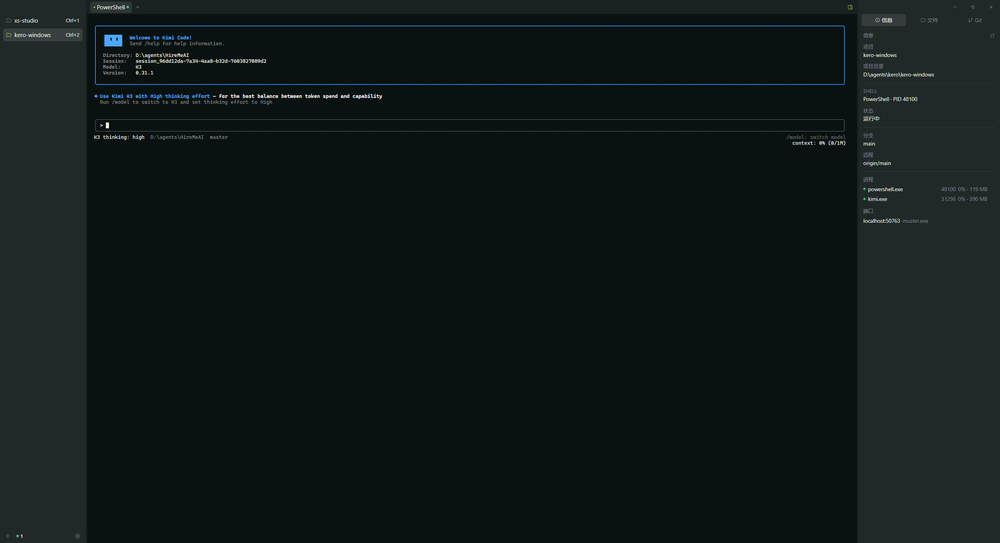

# Muster

**Muster** 是一个 Windows 原生的终端工作区：把终端、文件、差异对比和 Git 操作收进同一个窗口，让你不用切换到完整的 IDE，就能高效地查看和监督（包括 AI agent 写入的）代码变更。

基于 **Tauri 2 + React + xterm.js** 构建，后端使用 Rust 直接驱动 ConPTY 与 libgit2，轻量且启动迅速。



## 功能特性

- **多窗口**：可多开窗口并行工作；主窗口与次窗口的标签/分屏/项目布局定时快照、重启后完整恢复（次窗口使用确定性标签 `win-N`，跨重启保持）。关闭最后一个窗口后进程驻留系统托盘，终端会话不会被杀死，可从托盘菜单重新打开窗口或彻底退出
- **项目管理**：左侧栏以行形式展示 Git 仓库或普通文件夹，支持重命名、拖拽排序，`Ctrl+1~9` 快速切换
- **分屏布局**：niri 风格的列 × 行网格布局，支持拖拽 pane 到任意边缘重排、跨标签页拖拽（拖到标签头即移入目标标签）、焦点跟随、单 pane 最大化（zoom）
- **终端**：基于 ConPTY 的完整终端仿真（xterm.js），PowerShell 深度集成--每条命令执行后自动上报当前目录，应用可实时跟踪会话 cwd；支持终端响铃通知
- **Worktree 追踪**：终端 `cd` 进入 git worktree 后，Files/Git/Info 面板即时重新锚定到 worktree 根目录（事件驱动，无轮询延迟），信息面板显示 worktree 标记
- **文件编辑器**：Monaco 编辑器，语法高亮、查找替换、自动换行可选，主题跟随全局；顶部工具条提供内联 diff vs HEAD（Δ，编辑时实时更新）、git blame、文件历史；终端报错行 `path:line[:col]` 点击直达编辑器对应行
- **差异查看器**：Monaco Diff 视图，内联/分栏对比，主题跟随全局；支持任意两提交之间的对比（文件历史里点击提交 = 对比父提交，设置基准后可对比任意两版本）
- **文件树**：懒加载目录树，支持内联重命名、新建文件/文件夹；拖拽文件到终端可直接粘贴路径
- **Git 面板**：porcelain v2 状态、暂存/取消暂存、提交（`Ctrl+Enter` 快捷提交）、push/pull/fetch、分支管理与切换、stash、合并冲突检测、最近提交列表；每行右键「文件历史」；**检查点**——锚定一个 HEAD 快照，持续列出其后的全部变更（含 agent 的新提交），逐个打开对比 diff
- **项目搜索**：`Ctrl+Shift+F` 全项目全文搜索，gitignore/`.ignore` 感知（自动跳过 `node_modules`、`target`），结果按文件分组、命中高亮，Enter 直达文件行
- **终端搜索**：终端焦点下 `Ctrl+F` 弹出滚动回滚搜索条，边输边增量高亮，Enter/Shift+Enter 循环跳转
- **重开标签**：`Ctrl+Shift+T` 重开最近关闭的标签（文件按路径重开、diff 按提交重建、终端新建会话）
- **信息面板**：显示 shell PID、工作目录、项目根路径、Git 分支/远程信息，以及项目相关的进程和监听端口列表
- **用量面板**：只读汇总本机 AI 编程工具（Claude Code / Codex / OpenCode）的 token 用量与会话统计，附按日堆叠柱状图（按工具着色，悬停查看精确数值）
- **命令面板**：`Ctrl+P` 模糊搜索项目文件（gitignore 感知，最多 2000 条）、最近打开文件、所有命令和已打开的会话
- **标签切换器**：`Ctrl+Tab` 弹出覆盖层循环切换标签，带会话/文件路径预览
- **主题**：内置 GitHub 风格默认主题 + 完整 Ghostty 主题目录（数百款），深色/浅色独立设置，支持跟随系统；Monaco 编辑器与差异视图同步跟随
- **国际化**：中文 / English 界面，可跟随系统语言
- **会话持久化**：标签、分屏布局、项目与选中状态定时自动快照（每 5 秒），主窗口与次窗口重启后均完整恢复
- **Agent 感知**：识别会话进程树中的 coding agent（opencode / Claude Code / Codex / Kimi Code / aider / Gemini CLI / Goose），标签上显示状态点（绿=运行中、黄=等待输入、蓝=已完成待查看）；等待与完成都会在窗口失焦时发系统通知。检测原理是进程名 + 命令行匹配，无需 agent 配合
- **Agents 总览**：左下角常驻 mini-bar 跨窗口汇总所有 agent，按优先级（已完成 → 待输入 → 运行中）显示状态点加计数；点击展开列表，跨窗口跳转到对应 pane（`Ctrl+Shift+A`）
- **Agent CLI 桥**：`muster` 命令支持 agent 驱动的工作流——`muster split` 开分屏、`muster send <id> <text>` 发送文本、`muster send-keys <id> ctrl+c` 发送语义按键（enter/up/shift+tab/alt+f1 等）、`muster capture <id>` 读取终端输出（后端维护 400 行 ANSI 剥离的滚动回滚）、`muster run -- <cmd>` 在新标签真实 PTY 中执行并等待完成返回退出码、`muster wait <id> --until done` 事件式等待某 agent 完成、`muster watch` 以换行 JSON 流式订阅所有会话的 agent 状态变化、`muster procs <id>` 查看进程树与监听端口、`muster agents` 查看各会话 agent 状态（working/waiting/done）；自带 `skills/muster/SKILL.md` 供 AI 代理使用
- **CLI 工具**：可将 Muster 添加到系统 PATH，支持从任意终端使用 `muster <path>` 直接打开项目，或 `muster --cmd "vim foo.js" <path>` 在终端会话中执行命令
- **剪贴板安全保护**：当粘贴内容疑似可执行命令（多行命令、`sudo` / `curl` / `rm -rf` 等）时弹窗确认，防止意外执行恶意指令
- **无障碍**：跟随系统 `prefers-reduced-motion` 偏好，启用时全局禁用动画与过渡效果
- **资源管理器集成**：一键安装「在 Muster 中打开」右键菜单（写入 HKCU，无需管理员权限）

## 技术栈

| 层 | 技术 |
|---|---|
| 外壳 / 窗口 | Tauri 2（Rust），多窗口 + 系统托盘 + CLI PATH 注册 |
| 前端 UI | React 18 + TypeScript + Vite + Tailwind CSS |
| 终端仿真 | xterm.js（fit 插件） |
| PTY | 手动 ConPTY 驱动（bundled OpenConsole.exe） |
| 编辑器 / Diff | Monaco Editor |
| Git | git2（libgit2，含 SSH） |
| 剪贴板安全 | 前端粘贴拦截 + 危险内容检测 |
| 其他 | notify（文件监听）、sysinfo（进程/端口/agent 检测）、ignore（gitignore 感知的项目搜索）、rusqlite（用量统计，只读）、toml（配置）、winreg（PATH 注册表）、本地 TCP JSON IPC（`muster` CLI 桥） |

## 目录结构

```
kero-windows/
├── src/                    # React 前端
│   ├── components/         # 界面组件（终端、文件树、Git 面板、设置等）
│   ├── lib/                # invoke 封装、设置存储、主题、i18n、模糊匹配等
│   ├── hooks/              # Tauri 事件订阅等 React hooks
│   └── styles/             # 全局样式与设计变量
├── src-tauri/              # Rust 后端
│   ├── src/
│   │   ├── commands/       # 全部 Tauri 命令，按域拆分（前端 invoke 入口）
│   │   ├── models/         # 应用状态：项目、标签、pane、终端会话
│   │   ├── services/       # PTY/shell、git、配置、持久化、进程、CLI 等
│   │   └── theme/          # 主题目录与解析（含 Ghostty 主题）
│   ├── capabilities/       # Tauri 权限声明
│   └── assets/fonts/       # 内嵌字体（JetBrains Mono + Nerd Font 符号）
├── scripts/                # 主题目录生成脚本
└── docs/                   # 设计文档
```

## 开发

### 环境要求

- Windows 10/11（依赖 WebView2 与 ConPTY）
- [Node.js](https://nodejs.org/) 18+
- [Rust](https://rustup.rs/) 1.77+（MSVC 工具链）

### 启动开发环境

```sh
npm install
npm run tauri dev
```

### 常用命令

```sh
npm run dev            # 仅启动前端 Vite dev server
npm run build          # 前端类型检查 + 产物构建（tsc && vite build）
cargo check            # 后端编译检查（在 src-tauri/ 下执行）
cargo test             # 后端单元测试（在 src-tauri/ 下执行）
```

> 部分后端测试会真实创建进程和监听端口，默认被标记为 `#[ignore]`，需手动运行：
> `cargo test --lib -- --ignored`

### 本机工具链配置（可选）

`src-tauri/.cargo/config.toml` 不入库（已 gitignore），因为它是**单机有效**的 workaround：只有当 Windows SDK / MSVC 装在非标准位置、rustc 自动探测失败（典型报错：`LNK1181: cannot open input file 'kernel32.lib'`，或 cc-rs 找不到头文件）时才需要创建，内容形如：

```toml
[build]
rustflags = ["-L", "native=D:\\Windows Kits\\10\\Lib\\10.0.22621.0\\um\\x64"]

[env]
INCLUDE = "C:\\Program Files (x86)\\Microsoft Visual Studio\\2022\\BuildTools\\VC\\Tools\\MSVC\\14.44.35207\\include;..."
LIB = "C:\\Program Files (x86)\\Microsoft Visual Studio\\2022\\BuildTools\\VC\\Tools\\MSVC\\14.44.35207\\lib\\x64;..."
```

路径里的 MSVC/SDK 版本号需按本机实际安装调整；工具链在标准位置时不需要此文件。

### 打包发布

```sh
npm run tauri build    # 产出 MSI 和 NSIS 安装包（src-tauri/target/release/bundle/）
```

## 配置

配置文件为 TOML 格式，位于：

- 正式版：`%APPDATA%\muster\config.toml`
- 开发版（debug 构建）：`%APPDATA%\muster-dev\config.toml`

会话快照（各窗口的标签/分屏/项目布局）保存在同目录下的 `sessions*.json`。

## 命令行使用

在设置中选择 "Add Muster to PATH" 后，可在任意终端使用 `muster` 命令：

```sh
# 在当前目录打开 Muster 项目
muster .

# 在指定目录打开 Muster 项目
muster C:\projects\myapp

# 打开项目并立即运行命令
muster --cmd "npm run dev" C:\projects\myapp

# 指定工作目录并运行命令
muster --cwd C:\projects\myapp --cmd "git status"

# 在当前目录运行命令（无需指定路径）
muster --cmd "python hello.py"
```

快捷键 `-c` 和 `-d` 可分别替代 `--cmd` 和 `--cwd`。

### Agent 驱动的 CLI 桥

`muster <verb>` 通过本地 IPC 与正在运行的 Muster 通信（未运行时自动启动），
每步即进即出，供 AI 编码代理和其他脚本驱动终端：

```sh
muster doctor                 # 检查桥接状态
muster new C:\projects\myapp  # 打开项目，打印首个终端会话 id
muster split --v              # 向下分屏，打印新会话 id（--h 向右，默认）
muster send <id> "npm run dev" --enter   # 向会话发送按键
muster capture <id> --lines 200          # 读取会话最近输出（ANSI 已剥离）
muster procs <id>             # 会话进程树 + 监听端口
muster agents                 # 各会话的 coding agent 状态
muster run -- cargo test      # 新标签真实 PTY 运行命令，等待完成后输出+退出码
```

- `run` 默认 600s 超时（`--timeout N`）；`--` 之后的内容原样作为命令
- 任何 verb 加 `--json` 输出结构化结果
- 为 AI 代理准备的完整使用说明见 `skills/muster/SKILL.md`

## 快捷键

### 窗口与项目

| 快捷键 | 功能 |
|---|---|
| `Ctrl+N` | 新建项目 |
| `Ctrl+Shift+N` | 新建窗口 |
| `Ctrl+1` ~ `Ctrl+9` | 切换到第 N 个项目 |
| `Ctrl+Alt+[` / `Ctrl+Alt+]` | 上一个 / 下一个项目 |
| `Ctrl+,` | 打开设置 |
| `Ctrl+/` | 快捷键帮助 |

### 标签与分屏

| 快捷键 | 功能 |
|---|---|
| `Ctrl+T` | 新建终端标签 |
| `Ctrl+W` | 关闭当前标签 |
| `Ctrl+Shift+T` | 重开最近关闭的标签 |
| `Ctrl+Tab` / `Ctrl+Shift+Tab` | 标签切换器（循环切换） |
| `Ctrl+Shift+[` / `Ctrl+Shift+]` | 上一个 / 下一个标签 |
| `Ctrl+D` | 向右分屏 |
| `Ctrl+Shift+D` | 向下分屏 |
| `Ctrl+[` / `Ctrl+]` | 上一个 / 下一个 pane |
| `Ctrl+Alt+方向键` | 按方向切换 pane 焦点 |
| `Ctrl+Alt+Shift+方向键` | 按方向调整 pane 尺寸 |
| `Ctrl+Shift+Enter` | 当前 pane 最大化 / 还原 |

### 面板与工具

| 快捷键 | 功能 |
|---|---|
| `Ctrl+P` | 命令面板（项目文件 / 最近文件 / 命令 / 会话） |
| `Ctrl+B` | 切换左侧项目栏 |
| `Ctrl+Shift+B` | 切换右侧边栏 |
| `Ctrl+Shift+E` | 文件树面板 |
| `Ctrl+Shift+F` | 项目全文搜索 |
| `Ctrl+F` | 终端滚动回滚搜索（终端焦点下） |
| `Ctrl+Shift+A` | 切换 Agents 总览（左栏 mini-bar） |
| `Ctrl+Shift+G` | Git 面板 |
| `Ctrl+Shift+I` | 信息面板 |
| `Ctrl+Shift+U` | 用量面板 |
| `Ctrl+S` | 保存文件（编辑器中） |
| `Ctrl+K` | 清空终端 |

## 致谢

Muster 是 [Kero](https://github.com/egoist/kero) 的 Windows 重实现——Kero 是由 [@egoist](https://github.com/egoist) 开发的 macOS 原生终端工作区（Swift + libghostty）。本项目在产品形态与交互设计上深受其启发，在此致谢。

主题目录来源于 [Ghostty](https://ghostty.org/) 项目；终端字体为 [JetBrains Mono](https://www.jetbrains.com/lp/mono/) 与 [Nerd Fonts](https://www.nerdfonts.com/) 符号字体。
